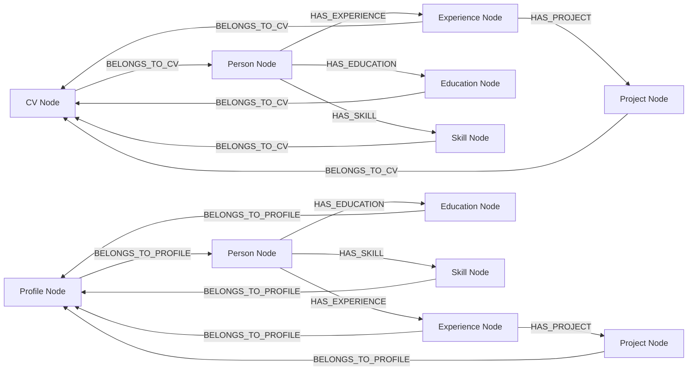

# Database Schema

The CV Generator uses Neo4j graph database to store CV data as nodes and relationships.

## Graph Schema

## Node Types

### CV Node

**Label**: `CV`

**Properties**:
- `id` (string): Unique CV identifier (UUID)
- `created_at` (string): ISO timestamp
- `updated_at` (string): ISO timestamp
- `filename` (string, optional): Generated DOCX filename
- `theme` (string, optional): CV theme name (classic, modern, minimal, elegant, or accented). Defaults to "classic" if not provided.

### Person Node

**Label**: `Person`

**Properties**:
- `name` (string): Full name
- `email` (string, optional): Email address
- `phone` (string, optional): Phone number
- `address_street`, `address_city`, `address_state`, `address_zip`, `address_country` (string, optional): Address components
- `linkedin` (string, optional): LinkedIn URL
- `github` (string, optional): GitHub URL
- `website` (string, optional): Personal website
- `summary` (string, optional): Professional summary

**Relationships**:
- `BELONGS_TO_CV` → CV node
- `BELONGS_TO_PROFILE` → Profile node (for master profile)
- `BELONGS_TO_PROFILE` → Profile node (for master profile)
- `HAS_EXPERIENCE` → Experience nodes
- `HAS_EDUCATION` → Education nodes
- `HAS_SKILL` → Skill nodes

### Experience Node

**Label**: `Experience`

**Properties**:
- `title` (string): Job title
- `company` (string): Company name
- `start_date` (string): Start date (YYYY-MM)
- `end_date` (string, optional): End date (YYYY-MM or "Present")
- `description` (string, optional): Short role description
- `location` (string, optional): Job location

**Relationships**:
- `BELONGS_TO_CV` → CV node
- `BELONGS_TO_PROFILE` → Profile node (for master profile)
- `HAS_PROJECT` → Project nodes

### Project Node

**Label**: `Project`

**Properties**:
- `name` (string): Project name
- `description` (string, optional): Short project description
- `url` (string, optional): Project URL
- `technologies` (list[string], optional): Technologies used
- `highlights` (list[string], optional): Bullet highlights

**Relationships**:
- `BELONGS_TO_CV` → CV node
- `BELONGS_TO_PROFILE` → Profile node (for master profile)

### Education Node

**Label**: `Education`

**Properties**:
- `degree` (string): Degree name
- `institution` (string): Institution name
- `year` (string, optional): Graduation year
- `field` (string, optional): Field of study
- `gpa` (string, optional): GPA

**Relationships**:
- `BELONGS_TO_CV` → CV node

### Skill Node

**Label**: `Skill`

**Properties**:
- `name` (string): Skill name
- `category` (string, optional): Skill category
- `level` (string, optional): Proficiency level

**Relationships**:
- `BELONGS_TO_CV` → CV node
- `BELONGS_TO_PROFILE` → Profile node (for master profile)

### Profile Node

**Label**: `Profile`

**Properties**:
- `updated_at` (string): ISO timestamp of last update

**Relationships**:
- Connected to Person node via `BELONGS_TO_PROFILE`
- Experience, Education, and Skill nodes connected via `BELONGS_TO_PROFILE`

**Note**: There is only one Profile node per database instance (single master profile). The Profile node does not have an ID since it's unique.

## Query Patterns

- **Create Profile**: Creates Profile node, Person node, and all related nodes with relationships in a single transaction.
- **Update Profile**: Updates existing Profile node by deleting old related nodes (Projects, Experiences, Education, Skills, Person) separately to avoid cartesian products, then creates new nodes with updated data. Nodes are deleted in dependency order (Projects → Experiences → Education/Skills → Person).
- **Read Profile**: Matches Profile node, uses CALL subqueries to traverse relationships and collect all related data, avoiding cartesian products.
- **Delete Profile**: Deletes Profile node and all related nodes and relationships.

- **Create CV**: Creates CV node, Person node, and all related nodes with relationships in a single transaction.
- **Read CV**: Matches CV by ID, traverses relationships to collect all related data.
- **Update CV**: Deletes old relationships and nodes, creates new ones with updated data.
- **Delete CV**: Deletes CV node and all related nodes and relationships.

See `backend/database/queries/` for implementation details.
