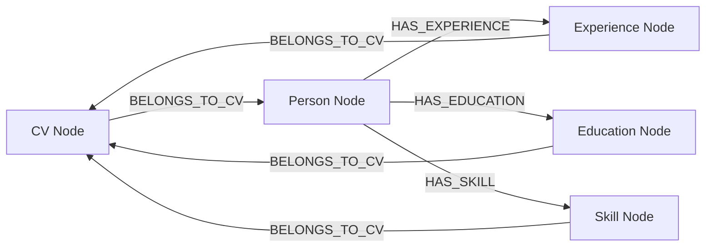

# Database Schema

The CV Generator uses Neo4j graph database to store CV data as nodes and relationships.

## Graph Schema

## Node Types

### CV Node

**Label**: `CV`

**Properties**:
- `id` (string): Unique CV identifier (UUID)
- `created_at` (string): ISO timestamp
- `updated_at` (string): ISO timestamp
- `filename` (string, optional): Generated ODT filename

### Person Node

**Label**: `Person`

**Properties**:
- `name` (string): Full name
- `email` (string, optional): Email address
- `phone` (string, optional): Phone number
- `address_street`, `address_city`, `address_state`, `address_zip`, `address_country` (string, optional): Address components
- `linkedin` (string, optional): LinkedIn URL
- `github` (string, optional): GitHub URL
- `website` (string, optional): Personal website
- `summary` (string, optional): Professional summary

**Relationships**:
- `BELONGS_TO_CV` → CV node
- `HAS_EXPERIENCE` → Experience nodes
- `HAS_EDUCATION` → Education nodes
- `HAS_SKILL` → Skill nodes

### Experience Node

**Label**: `Experience`

**Properties**:
- `title` (string): Job title
- `company` (string): Company name
- `start_date` (string): Start date (YYYY-MM)
- `end_date` (string, optional): End date (YYYY-MM or "Present")
- `description` (string, optional): Job description
- `location` (string, optional): Job location

**Relationships**:
- `BELONGS_TO_CV` → CV node

### Education Node

**Label**: `Education`

**Properties**:
- `degree` (string): Degree name
- `institution` (string): Institution name
- `year` (string, optional): Graduation year
- `field` (string, optional): Field of study
- `gpa` (string, optional): GPA

**Relationships**:
- `BELONGS_TO_CV` → CV node

### Skill Node

**Label**: `Skill`

**Properties**:
- `name` (string): Skill name
- `category` (string, optional): Skill category
- `level` (string, optional): Proficiency level

**Relationships**:
- `BELONGS_TO_CV` → CV node

## Query Patterns

- **Create CV**: Creates CV node, Person node, and all related nodes with relationships in a single transaction.
- **Read CV**: Matches CV by ID, traverses relationships to collect all related data.
- **Update CV**: Deletes old relationships and nodes, creates new ones with updated data.
- **Delete CV**: Deletes CV node and all related nodes and relationships.

See `backend/database/queries/` for implementation details.
